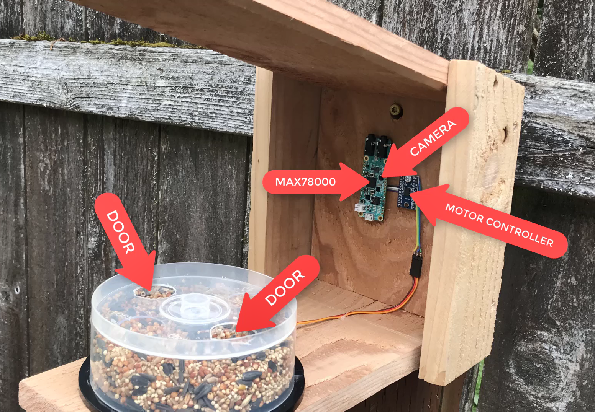

# AiBirdFeeder

A bird feeder that uses AI to stop squirrels from eating the seed



## Prerequisites

1. Read [MAX78000 EV-Kit Guide](https://github.com/MaximIntegratedAI/MaximAI_Documentation/blob/master/MAX78000_Evaluation_Kit/README.md)
2. Install software prereqs like PyTorch etc. See [ADI docs](https://github.com/MaximIntegratedAI/ai8x-synthesis#prerequisites)

## Training

Pull the code needed to run the tools:

```bash
git clone git@github.com:joecrop/AiBirdFeeder.git
cd ai8x-tools
git submodule update --init --recursive
git pull --recurse-submodules --jobs=10
git clone --single-branch --branch pytorch-1.8 https://github.com/MaximIntegratedAI/distiller.git
```

Once the initial setup is done, you can jsut source train.sh from then on.

```bash
cd ai8x-tools
source train.sh
```

Now you can launch the training:

```bash
./scripts/train_birdfeeder.sh
# Or, if you don't have a good GPU:
#./scripts/train_birdfeeder.sh --workers=1
```

Then generate test data

```bash
./scripts/evaluate_birdfeeder.sh --workers=1 --save-sample 10
```

## Synthesis

```bash
cd ai8x-tools
deactivate
source izer.sh
```

### Quantize

```bash
./scripts/quantize_birdfeeder.sh
```

### Generate C code

> Make sure the /birdfeeder path of this repo is checked in and there are no modified files, as this step will overwrite the code.

```bash
./scripts/gen_birdfeeder_max78000.sh --overwrite
```
